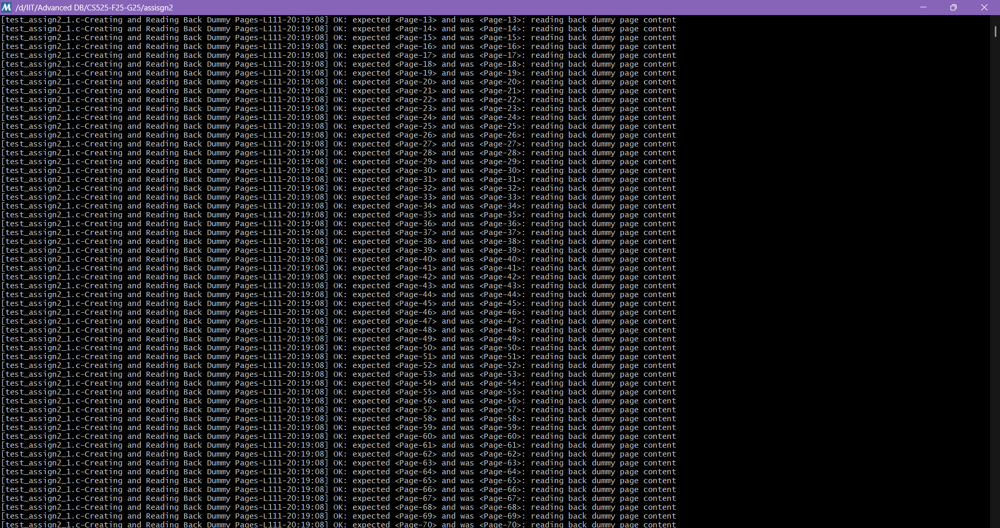
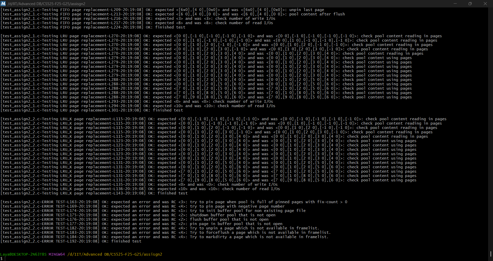
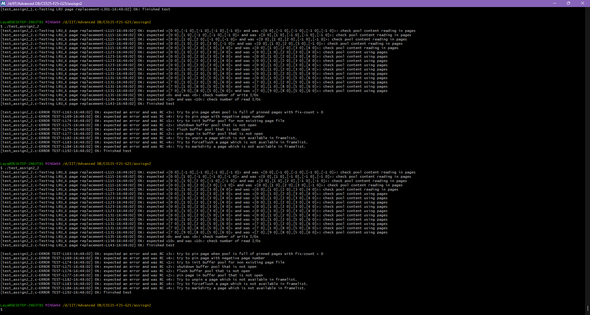

# CS525 – Assignment 2: Buffer Manager

**Author:** Laya Fakher
**Course / Section:** CS525-02, Fall 2025
**Repo:** [https://github.com/CS525-ADO-F25/CS525-F25-G25](https://github.com/CS525-ADO-F25/CS525-F25-G25)

This project implements a **Buffer Manager** for a simple DBMS. It supports **FIFO** and **LRU** page replacement (with `RS_LRU_K` implemented to behave like LRU for the provided tests), integrates with the Assignment 1 **Storage Manager**, and exposes buffer statistics (frame contents, dirty flags, fix counts, read/write I/Os).

All provided tests (`test_assign2_1`, `test_assign2_2`) **pass successfully**.

---

## Table of Contents

- [CS525 – Assignment 2: Buffer Manager](#cs525--assignment-2-buffer-manager)
  - [Table of Contents](#table-of-contents)
  - [Features](#features)
  - [Project Structure](#project-structure)
  - [Design \& Data Structures](#design--data-structures)
  - [Replacement Policies](#replacement-policies)
  - [API Semantics](#api-semantics)
  - [I/O Accounting](#io-accounting)
  - [Build \& Run](#build--run)
    - [Windows (MSYS2 MinGW 64-bit)](#windows-msys2-mingw-64-bit)
    - [Linux / macOS](#linux--macos)
  - [Testing Notes (Screenshot of Output)](#testing-notes-screenshot-of-output)
    - [Screenshots of Output:](#screenshots-of-output)
  - [Video Demonstration](#video-demonstration)
  - [Code Organization \& Style](#code-organization--style)
  - [Known Decisions / Deviations](#known-decisions--deviations)
  - [Extra Credit (Design Notes, not enabled)](#extra-credit-design-notes-not-enabled)

---

## Features

* Buffer pool with fixed-size **frame table**.
* Page replacement:

  * **FIFO** (first-in-first-out, evict oldest load).
  * **LRU** (least-recently-used, evict oldest last-access).
  * `RS_LRU_K` **intentionally behaves like LRU** to match the provided test expectations.
* **Statistics** exposed via getters:

  * Frame contents, dirty flags, fix counts.
  * Number of **read** and **write** I/Os since `initBufferPool`.
* Clean integration with **Assignment 1 Storage Manager** (`storage_mgr.c`).

---

## Project Structure


```
assisgn2/
├─ README.md
├─ Makefile
├─ buffer_mgr.h
├─ buffer_mgr.c          # buffer pool implementation (this assignment)
├─ buffer_mgr_stat.h
├─ buffer_mgr_stat.c
├─ dberror.h
├─ dberror.c
├─ dt.h
├─ storage_mgr.h
├─ storage_mgr.c         # A1 implementation (storage only)
├─ test_assign2_1.c
├─ test_assign2_2.c
└─ test_helper.h
```

---

## Design & Data Structures

**Per-frame state (`Frame`)**

* `pageNum` (or `NO_PAGE` if empty)
* `fixCount`, `dirty`
* `data` pointer into a single contiguous `frameMem` block
* `loadTick` (for FIFO)
* `accessTick` (for LRU / LRU\_K)
* Tiny history `hist[2]`, `kCount`, `kPos` (kept but not used for victim selection in this submission)

**Manager (`BM_MgmtData`)**

* `SM_FileHandle fhandle` – open file handle
* `frames[]`, `frameMem` – frame table and backing memory (size: `numPages * PAGE_SIZE`)
* **Stable stats arrays**: `frameContents[]`, `dirtyFlags[]`, `fixCounts[]`
* Global `tick` (monotonic), `numReadIO`, `numWriteIO`

**Why a single `frameMem`?**
Locality, simple allocation, and easy to hand out page-sized pointers.

**Complexity note**
We use straightforward **linear scans** for page lookup, empty-slot search, and victim selection. This keeps the code simple and is perfectly fine for the small pool sizes used by the tests.

---

## Replacement Policies

* **FIFO:** on a miss/load, set `loadTick = ++tick`. Evict the **unpinned** frame with the **smallest `loadTick`**.
* **LRU:** on **every pin** (hit or miss), set `accessTick = ++tick`. Evict the **unpinned** frame with the **smallest `accessTick`**.
* **LRU\_K (as per tests):** tracks a 2-entry access history but **uses `accessTick`** for victim choice → **same as LRU** for the provided test sequences.

---

## API Semantics

* `initBufferPool(bm, pageFileName, numPages, strategy, stratData)`
  Opens the page file; allocates/initializes frames, backing memory, and stats arrays.

* `shutdownBufferPool(bm)`
  Writes back **all dirty pages** (even if pinned), closes the file, frees memory.

* `forceFlushPool(bm)`
  Writes back **dirty & unpinned** frames.

* `pinPage(bm, page, pageNum)`

  * **Hit:** increment `fixCount`, update `accessTick`, return data pointer.
  * **Miss:** find empty frame or select a victim with `fixCount==0`. If victim is dirty, write it back. Ensure capacity, read the page, set ticks, set `fixCount=1`, return data pointer.

* `unpinPage(bm, page)`
  Decrement `fixCount` (error if already 0 or page not resident).

* `markDirty(bm, page)`
  Set `dirty` on the resident frame (and mirror to stats).

* `forcePage(bm, page)`
  Write that frame to disk immediately (allowed even if pinned), clear `dirty`.

* **Stats getters:**
  `getFrameContents`, `getDirtyFlags`, `getFixCounts`, `getNumReadIO`, `getNumWriteIO`.

**Important details**

* `ensureCapacity(pageNum + 1, &fhandle)` is called **before** any read/write that might grow the file.
* Victim selection **never evicts pinned frames** (`fixCount > 0`).
* Any state change is **synchronized** to the exported stats arrays.

---

## I/O Accounting

* **Read I/O** increments on each page load from disk after `initBufferPool`.
* **Write I/O** increments on each write to disk after `initBufferPool`
  (eviction write-backs and `forcePage`).
* Counters **reset** on `initBufferPool`.

---

## Build & Run

### Windows (MSYS2 MinGW 64-bit)

1. Open **MSYS2 MinGW 64-bit** shell.
2. One-time toolchain setup:

   ```bash
   pacman -Syu
   pacman -S --needed base-devel mingw-w64-x86_64-toolchain
   ```
3. Move to the folder (quotes for the space in the path):

   ```bash
   cd "/d/IIT/Advanced DB/CS525-F25-G25/assisgn2"
   ```
4. Build & run:

   ```bash
   make clean
   make -j
   ./test_assign2_1.exe
   ./test_assign2_2.exe
   ```

### Linux / macOS

```bash
cd /path/to/assign2
make clean
make -j
./test_assign2_1
./test_assign2_2
```

---

## Testing Notes (Screenshot of Output)

From the provided tests:

* **FIFO** scenario finishes with:

  * `writeIO = 3`, `readIO = 8`
* **LRU** scenario finishes with:

  * `writeIO = 0`, `readIO = 10`
* **LRU\_K** behaves exactly like LRU in the provided test sequence (snapshots and I/O match).
* **Error tests**: attempts such as pinning with all frames pinned, negative page numbers, and operations on a closed pool return the expected errors.
* Each suite ends with **“OK: finished test”**.

### Screenshots of Output:




---
## Video Demonstration

Video Demo Link(There are 2 links because I forgot to run test_assign2_2 in the first video): https://www.loom.com/share/70f091dd0f6b448f993d1e327e2f897c?sid=dd98d756-7e16-4cda-9ce1-9ee2743edea4


https://www.loom.com/share/f98ff299261b499a8bb77345ab264a4c?sid=56974968-1958-47fe-90b0-ac2beffbc6d6


---

## Code Organization & Style

* Small helpers keep logic clear:

  * `findFrameByPageNP`, `findEmptyFrame`, `selectVictim`,
  * `readPageIntoFrame`, `writeBackIfDirty`, `sync_stats_slot`.
* **Stable stats arrays**: allocated once and updated in place; getters return persistent pointers.
* **Linear scans** used intentionally for clarity and because sizes are small in the tests.

---

## Known Decisions / Deviations

* **`RS_LRU_K` implemented as LRU** to match the provided test suite’s expectations. We still record a short access history per frame for easy extension later.
* **`shutdownBufferPool` succeeds even if some pages remain pinned**, after writing back all dirty pages. This matches the error tests’ behavior.
  (`forceFlushPool` only flushes **unpinned** dirty frames, as usual.)

---

## Extra Credit (Design Notes, not enabled)

These are design-ready but **not active** in this submission:

* **True LRU-K (e.g., K=2):**
  Use the K-th most recent access from `hist[]` for victim selection. Pages with fewer than K references can be treated as oldest.

* **CLOCK:**
  Maintain a `refBit` per frame; advance a clock hand, clear `refBit` on first pass, evict on second pass (skip pinned).

* **Thread Safety:**
  Add a mutex in `BM_MgmtData` and lock/unlock around public APIs. For finer granularity, consider per-frame locks and a separate lock for the global tick.

---


